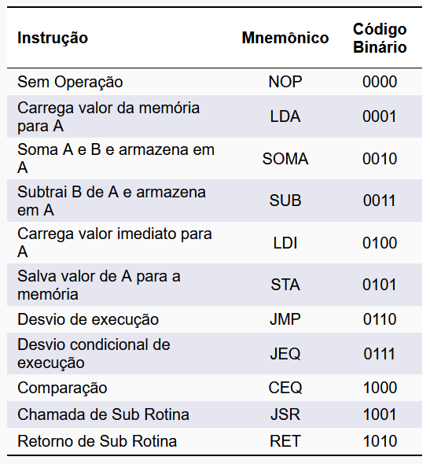
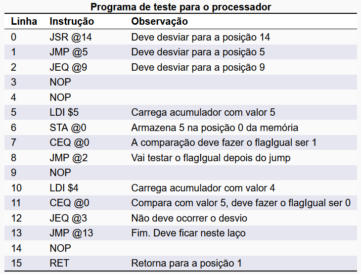
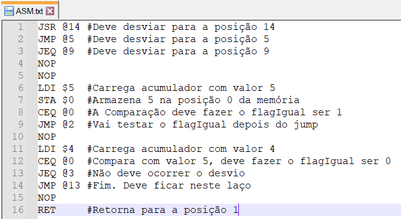
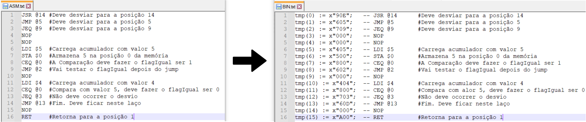

# Assembler

Montador assembler utilizando linguagem python.

## Objetivos

Implementação de um programa em linguagem python que traduz seu código assembly em linguagem de máquina do processador desenvolvido na disciplina Design de Computadores - Engenharia de Computação (INSPER).

## Contextualização

Os programas para computadores ao longo do tempo se tornaram cada vez mais complexos, com isso surgiu a necessidade de simplificar a escrita desses programas. Para isso foi criado a linguagem assembly, uma linguagem que através de mnemônicos permite programar o software que será implementado em um computador.

Cada arquitetura possui seu próprio código de máquina, por isso, não existe uma padronização da linguagem assembly, tornando dificultoso a portabilidade do código. Para este estudo guiado usaremos a arquitetura acumulador e o assembly desenvolvido na disciplina de Design de Computadores (2025b) do curso de Engenharia de Computação do INSPER.


### 1. Fluxo de Dados - Arquitetura Baseada em Acumulador


### 2. Formato das Instruções


### 3. Mnemônicos - Arquitetura Baseada em Acumulador




### 4. Programa de teste





### 5. Arquivo "ASM.txt" com o programa teste




## Funcionamento

O Assembler desenvolvido em python (Assembler_Acumulador.py) irá traduzir a linguagem assembly (contida no arquivo ASM.txt) em linguagem de máquina pronta para ser utilizada no módulo memoriaROM do processador desenvolvido em VHDL (contida no arquivo BIN.txt).





### 1. Definição dos arquivos

```python
assembly = 'ASM.txt' #Arquivo de entrada que contém o assembly
destinoBIN = 'BIN.txt' #Arquivo de saída que contém o binário formatado para VHDL
```


### 2. Definição dos mnemônicos, utilizando dicionário

```python
# Dicionário de mnemônicos
mne = {
    "NOP": "x\"0",
    "LDA": "x\"1",
    "SOMA": "x\"2",
    "SUB": "x\"3",
    "LDI": "x\"4",
    "STA": "x\"5",
    "JMP": "x\"6",
    "JEQ": "x\"7",
    "CEQ": "x\"8",
    "JSR": "x\"9",
    "RET": "x\"A",
}
```

## OBS:

1) Para qualquer instrução implementada, lembre-se de também adicionar a mesma no dicionário de mnemônicos
2) Esse programa também formata o código ASM para arquivo um .mif, no seguinte padrão:

```vhdl
WIDTH=13;
DEPTH=256;
ADDRESS_RADIX=DEC;
DATA_RADIX=BIN;

CONTENT BEGIN
--endereco   :   dado
     0	:	1001000001110;	-- JSR .JMP_14  #Deve desviar para a posição 14
```

